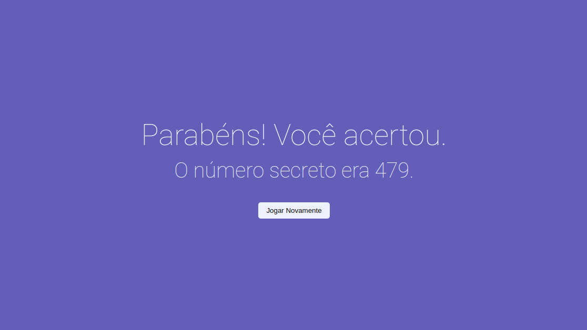

# Projeto Número Secreto

O projeto número secreto foi desenvolvido durante um curso da Alura na formação Javascript para Front-end.
Aqui, exploramos vários aspectos da linguagem javascript como a manipulação do DOM, eventos e exploramos a [Web Speech API](https://developer.mozilla.org/en-US/docs/Web/API/Web_Speech_API) com SpeechRecognition.

<!-- Inserir imagem com a #vitrinedev ao final do link -->

